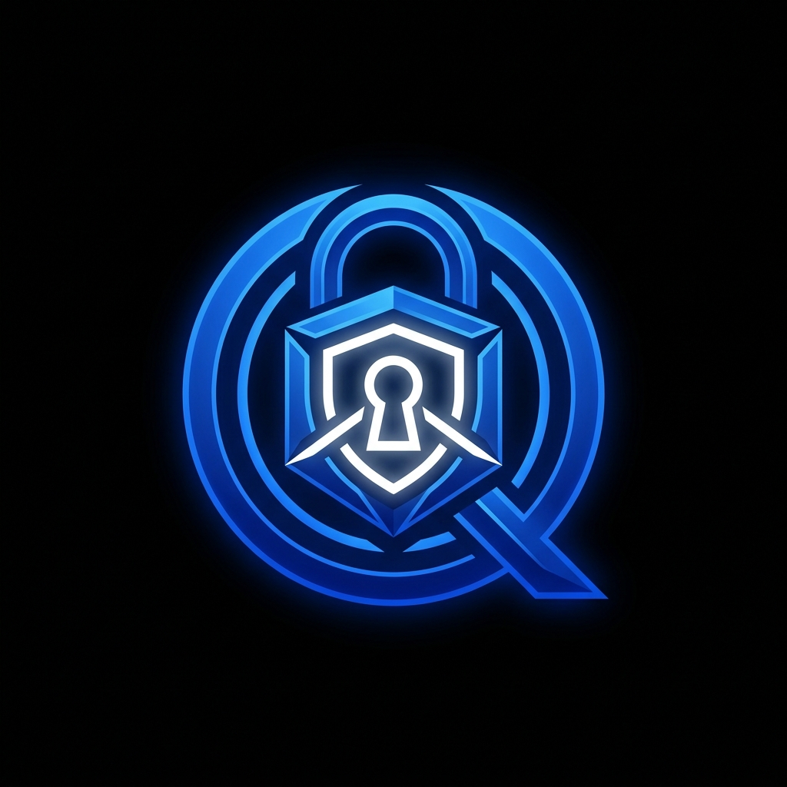

<div align="center">
  
  <h1>QuantumCrypt Docs Hub</h1>
  <p><strong>The official React/Vite frontend documentation site for the <a href="https://pypi.org/project/qcrypt/">QuantumCrypt</a> python framework.</strong></p>
</div>

---

### Overview

This repository directory (`/docs-site`) contains the source code for the official documentation of the `qcrypt` Post-Quantum Cryptography library. It is built natively on top of Vite, React, and TailwindCSS v4. 
The documentation hub maps out usage instructions for ML-KEM and ML-DSA implementations.

## Features
- **Dark Mode Native**: Complete glassmorphism architecture.
- **Responsive Layout**: Designed for seamless developer reading on mobile or desktop via standard Tailwind breakpoints.
- **Embedded Changelogs**: Dynamically switch to track patches & security improvements.
- **Zero-Config Deployment**: Optimized to statically build and deploy immediately onto Vercel / Netlify.

### Local Development

1. Ensure you have Node.js 18+ installed.
2. Install dependencies:
   ```bash
   npm ci
   ```
3. Run the development server locally:
   ```bash
   npm run dev
   ```

### Production Build

To statically generate the documentation site:
```bash
npm run build
```
This will output a `dist/` root which can be served over any static platform.
